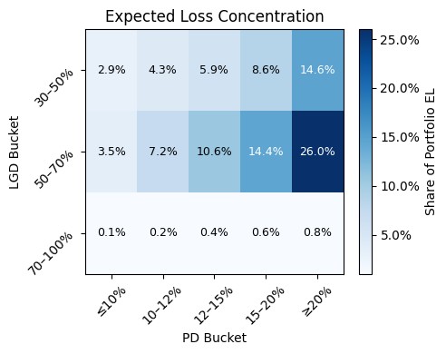
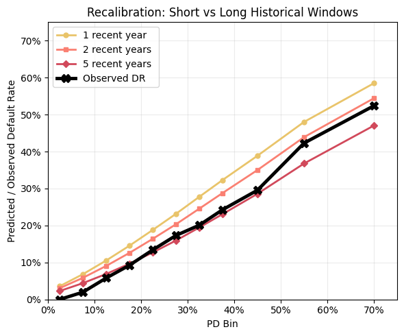

### Credit Risk Modelling Framework

#### Introduction

This project is a modular Python framework for developing, calibrating, validating, and analysing application-time Probability of Default (PD) models for unsecured consumer lending. It implements an end-to-end credit risk workflow, from data preprocessing and feature engineering to model calibration, portfolio decisioning, performance evaluation, and expected loss analysis.

The framework has been designed with reusability in mind. Instead of isolated notebooks, the core functionality is organised into reusable Python modules, making it easy to train new models, compare modelling strategies, evaluate different decision thresholds, and extend the framework with additional monitoring and governance capabilities.

The project is inspired by real-world credit risk modelling workflows used in financial institutions and aims to bridge the gap between exploratory data science notebooks and a reusable production-style machine learning framework.

<table align="center" border="0" cellspacing="0" cellpadding="0">
  <tr>
    <td></td>
    <td></td>
  </tr>
</table>

#### The framework answers questions such as:

1. How can a robust application-time PD model be developed from historical lending data?
1. Which preprocessing and feature engineering steps are required before modelling?
1. How does Logistic Regression compare with Gradient Boosting for this portfolio?
1. How well calibrated are the predicted probabilities?
1. Which calibration technique performs best?
1. How should an optimal PD acceptance threshold be selected?
1. What is the impact of a threshold on Approval/Default Rates and Expected Loss?
1. How stable is the model on unseen data?
1. How can model performance be evaluated using discrimination, calibration, and business metrics?
1. How can Population Stability Index (PSI) and feature drift be monitored? (in progress)
1. How can model governance and monitoring dashboards support retraining decisions? (in progress)

#### Future Development

1. Drift Monitoring (in progress)
1. Governance Dashboard (in progress)
1. API Deployment (planned)
1. Configuration-driven execution (planned)