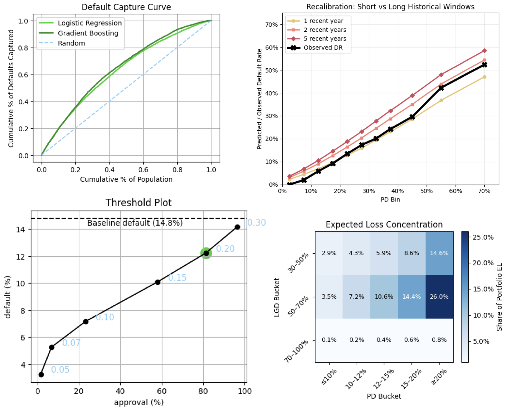

### Credit Risk Modelling Framework

#### Introduction

This project is a modular Python framework for developing, calibrating, validating, and analysing application-time Probability of Default (PD) and Loss Given Default (LGD) models for unsecured consumer lending. It implements an end-to-end credit risk workflow, from data preprocessing and feature engineering to model calibration, portfolio decisioning, performance evaluation, and expected loss analysis.

The framework has been designed with reusability in mind. Instead of isolated notebooks, the core functionality is organised into reusable Python modules, making it easy to train new models, compare modelling strategies, evaluate different decision thresholds, and extend the framework with additional monitoring and governance capabilities.

The project is inspired by real-world credit risk modelling workflows used in financial institutions and aims to bridge the gap between exploratory data science notebooks and a reusable production-style machine learning framework.

  

#### The framework answers questions such as:

⚫ How can a robust application-time Probability of Default (PD) model be developed from historical lending data? 
⚫ Which preprocessing and feature engineering steps are required before modelling? 
⚫ How do Logistic Regression and Gradient Boosting compare for application-time PD modelling? 
⚫ How well calibrated are the predicted probabilities? 
⚫ Which calibration technique provides the best probability estimates? 
⚫ How can an optimal PD acceptance threshold be selected? 
⚫ What is the impact of different approval thresholds on Approval Rate, Default Rate and Expected Loss? 
⚫ How can application-time Loss Given Default (LGD) be estimated using empirical and modelling approaches? 
⚫ How can portfolio Expected Loss (EL) be quantified and visualized? 
⚫ How can portfolio loss distributions be estimated using Monte Carlo simulation? 
⚫ How can Value-at-Risk (VaR) and Economic Capital be estimated from simulated portfolio losses? 
⚫ How can Monte Carlo estimates be validated against deterministic Expected Loss? 
🟢 How can portfolio Economic Capital be allocated back to individual exposures? 
🟢 How can Population Stability Index (PSI) and feature drift be monitored? 
🟢 How can model governance and monitoring dashboards support retraining decisions? 
🟢 How can application-time LGD modelling be further improved? 
⚪ How can correlated defaults be incorporated into the Monte Carlo simulation? 
⚪ How can macroeconomic scenarios and stress testing be incorporated? 
⚪ How can the framework be executed through configuration files? 
⚪ How can the framework be deployed as an API? 

**Status:** ⚫ Implemented | 🟢 In Progress | ⚪ Planned